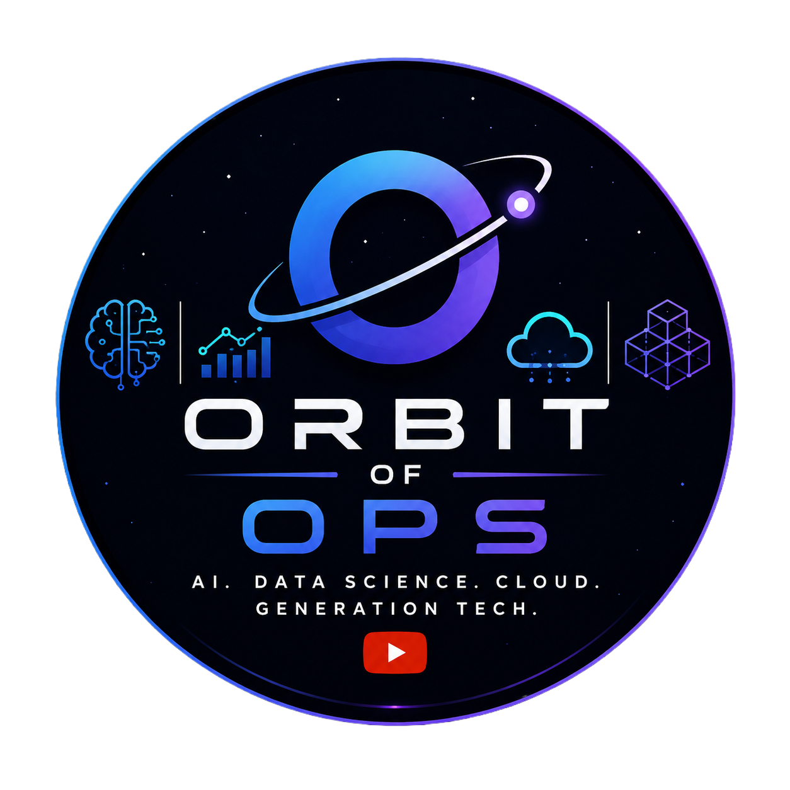

# Explore Generative AI with the Gemini API in Agent Platform: Challenge Lab || [GSP515](https://www.skills.google/course_templates/959/labs/629194) ||

### ⚙️ Execute the Following Commands in Notebook Terminal

```
rm gemini-explorer-challenge.ipynb

curl -LO raw.githubusercontent.com/Orbit-of-Ops/Google-Cloud-Labs-Solutions/refs/heads/main/Discover%20and%20Protect%20Sensitive%20Data%20Across%20Your%20Ecosystem%20Challenge%20Lab/deidentify-model-response-challenge-lab.ipynb

curl -L -o logo.png "https://orbitofops.com/logo.png"
```

# 🎉 Woohoo! You Did It! 🎉

Your hard work and determination paid off! 💻
You've successfully completed the lab. **Way to go!** 🚀

#  Orbit of Ops
